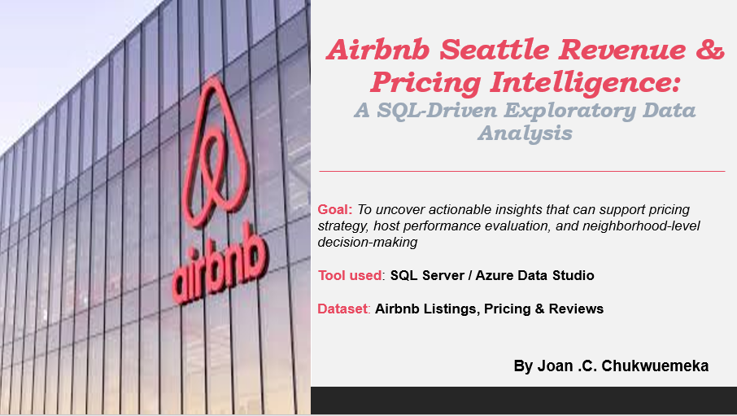

# Seattle Airbnb SQL Exploratory Data Analysis

SQL-based exploratory data analysis of Seattle Airbnb listings, focused on revenue, pricing, neighborhoods, host activity, and guest review patterns.

- Full SQL queries and results (notebook included in link)
[View Full SQL Queries in Azure Notebook](https://drive.google.com/file/d/1QdRGxs4D-Z2s3yuCybCl4Wr0J_kbxFPr/view?usp=sharing)

- Insights documentation and visual summary for Airbnb Seattle listings (PDF included in link)
[View Insights PDF](https://drive.google.com/file/d/1dU3Z1m8aZJJOKw7y3tBwSC4omTT-LxL2/view?usp=sharing)

## Business Problem
Airbnb hosts and property managers need to understand **what drives revenue**, how **pricing and location influence bookings**, and which hosts maintain high guest satisfaction.
Without analyzing listing, pricing, and review data, it is difficult to optimize listings, improve guest experience, and make informed pricing decisions.

## Objective
- Explore Airbnb listings in Seattle to uncover pricing, location, and host behavior trends
- Identify factors driving revenue performance
- Highlight opportunities for hosts to improve guest satisfaction and occupancy

**Key Metrics / Focus Areas**
- Revenue per listing
- Pricing distribution by neighborhood
- Guest sentiment and review consistency
- Host activity and listing engagement

## Dataset
- **Source:** Airbnb Seattle listings dataset (Mentorship Program - Week 3)
- **Coverage:** 2,000+ listings
- **Key Fields:**
  - Listing ID
  - Neighborhood / Location
  - Price
  - Number of reviews / review ratings
  - Host activity status
  - Revenue (calculated from price x occupancy)

## Tools Used
- SQL (T-SQL)
- Azure Data Studio (Notebooks)
- SSMS (for database selection and queries)

## Analysis Approach

### Data Preparation
- Selected database and tables relevant to Seattle Airbnb listings
- Cleaned and filtered data for active listings only
- Handled nulls and inconsistencies in price, reviews, and host data

### Exploratory & Diagnostic Analysis
- Revenue by listing and neighborhood
- Price distribution across neighborhoods
- Guest sentiment analysis using review counts and ratings
- Host activity segmentation (active vs inactive listings)

### SQL Techniques Applied
- Database selection queries
- INNER/LEFT JOINs for combining tables
- Subqueries for filtering and calculating metrics
- Common Table Expressions (CTEs) for stepwise analysis
- Aggregate functions and grouping
- Ranking and ordering for top-performing listings

## Key Insights
- Revenue is largely driven by **affordable, high-volume listings**, not only premium-priced units.
- Listing prices vary significantly by neighborhood, reflecting **location-based market dynamics**.
- While most guest sentiment is positive, **only ~500 listings consistently maintain strong reviews**.
- Host activity is uneven; some hosts manage multiple active listings, while others remain largely inactive.

## Recommendations
- **Hosts & Managers**
  - Focus on high-volume, competitively priced listings to maximize revenue
  - Encourage consistent review collection and engagement to maintain guest satisfaction
- **Pricing Strategy**
  - Consider neighborhood-specific pricing adjustments based on local market trends
- **Operational Decisions**
  - Monitor inactive hosts and target engagement strategies to increase active listing participation

## Skills Demonstrated
- SQL querying for exploratory data analysis
- Database joins, subqueries, and CTEs
- Azure Data Studio Notebook usage
- Combining technical SQL insights with business context
- Revenue, pricing, and sentiment analysis using SQL
